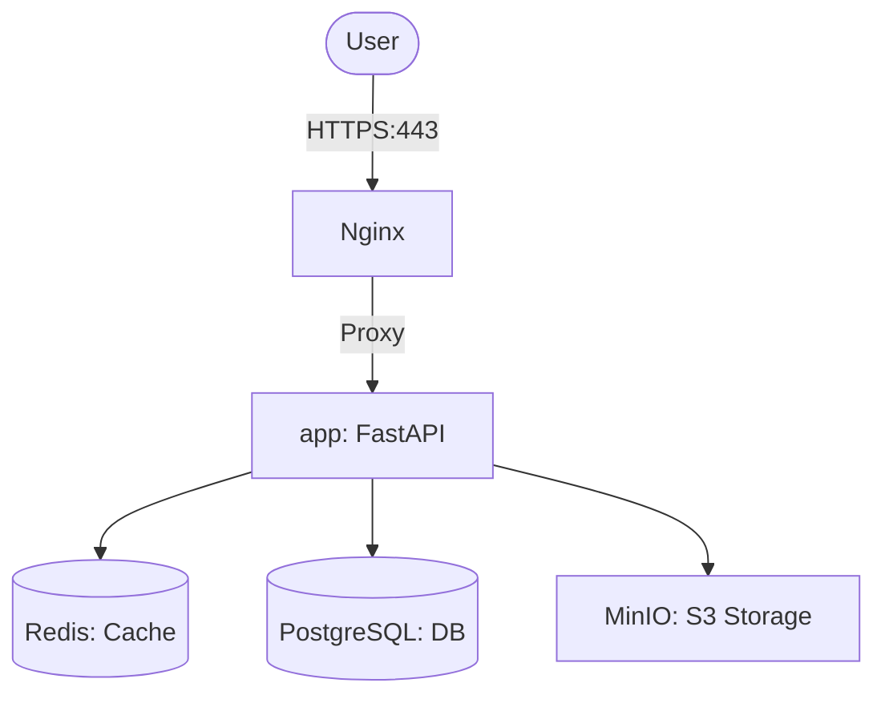

# Urban Places Social App - Backend

A FastAPI-based backend for a social application focused on urban places, routes, and location-based features.

> [!IMPORTANT]
> **Study Project Disclaimer**: This branch is a dedicated environment for studying **Kubernetes** orchestration, local cluster management (Minikube), and cloud-native reliability patterns (HPA, Health Probes). It is specialized for educational purposes and local experimentation, and is not intended for production use as-is.

## Architecture



### Tech Stack

- **Framework**: FastAPI (Python 3.12)
- **Database**: PostgreSQL 15 (Async)
- **Cache**: Redis 7
- **Storage**: MinIO (S3-compatible)
- **Reverse Proxy**: Ingress-Nginx (Kubernetes)
- **Orchestration**: Kubernetes (Minikube / Production Cluster)
- **Scaling**: Horizontal Pod Autoscaler (HPA)
- **Monitoring**: Metrics Server (K8s-native)

### Key Features

- **Kubernetes Native**: Optimized for modern cloud-native environments.
- **Auto-Scaling**: Automatic scaling based on CPU and Memory utilization.
- **Reliability**: Built-in health checks (liveness, readiness, startup) and graceful shutdown logic.
- **Social**: Friend systems, real-time messaging, and notifications.
- **Geography**: Location-based discovery and route planning.

## Quick Start (Local Kubernetes)

This branch is specialized for **Kubernetes**. To run the project locally, you'll need [Minikube](https://minikube.sigs.k8s.io/docs/start/).

### 1. Initialize Cluster

```bash
minikube start --driver=docker
minikube addons enable ingress
minikube addons enable metrics-server
```

### 2. Deploy the Stack

Use the provided automation script to build the image and deploy all manifests:

```bash
./setup_local_k8s.sh
```

### 3. Access the Project

Update your `/etc/hosts` with the Minikube IP (provided by the script) for `api.places.internal`.

- **Interactive API Docs**: <http://api.places.internal/docs>
- **Ready Check**: <http://api.places.internal/health/ready>

> [!TIP]
> For detailed instructions and troubleshooting, refer to the **[K8s Minikube Setup Guide](docs/K8S_MINIKUBE_SETUP.md)**.

---

## Testing

Run tests within the Kubernetes environment:

```bash
# Example: Exec into a running pod to run tests
kubectl exec -it deployment/places-backend -n places-backend -- pytest
```

---

## CI/CD

This project is configured for cloud-native deployment:

- **CI**: GitHub Actions for automated testing and container image building.
- **CD**: Kubernetes-native deployment (ArgoCD or Helm ready).

---

## Documentation Index

| Guide | Description |
| --- | --- |
| **[K8s Minikube Setup](docs/K8S_MINIKUBE_SETUP.md)** | **Start here** for local development on Kubernetes. |
| **[API Reference](docs/API.md)** | Endpoints, request/response schemas, and auth. |
| **[Backend Development](docs/DEVELOPMENT_BACKEND.md)** | Development workflow and coding standards. |
| **[App Monitoring](docs/MONITORING.md)** | HPA, Metrics, and K8s observability. |

---

## License

[Your License Here]
