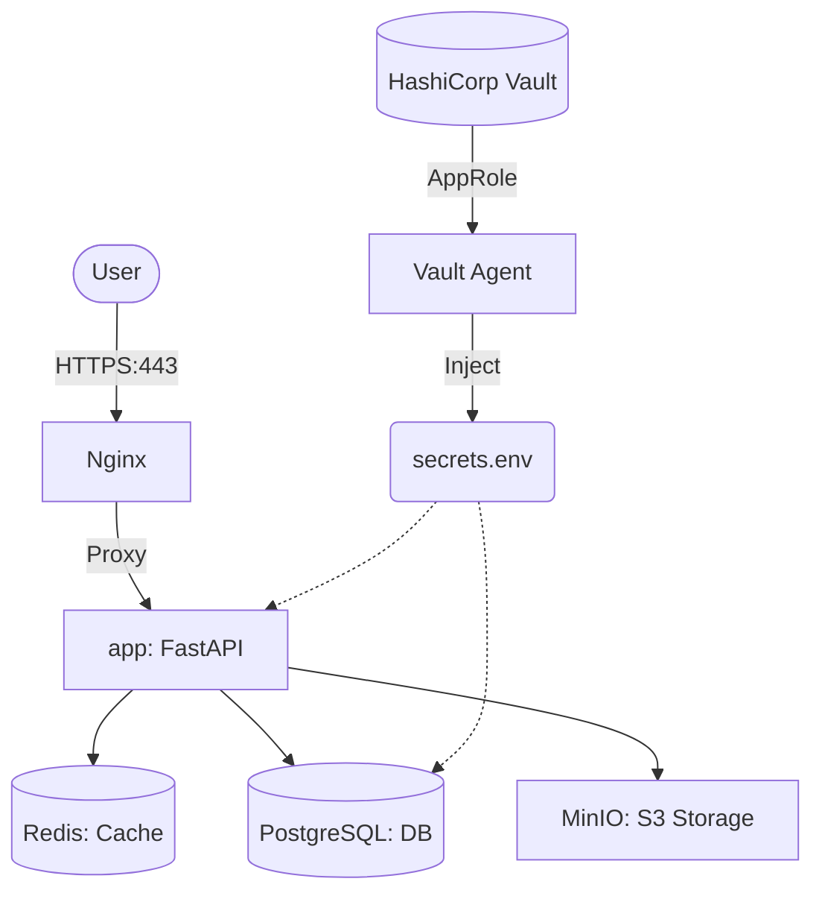

# Urban Places Social App - Backend

A FastAPI-based backend for a social application focused on urban places, routes, and location-based features.

## Alternative Implementations

This project includes alternative architectural approaches in dedicated branches:

| Branch | Topic | Implementation Details |
| :--- | :--- | :--- |
| **[`feat-hcorpvault`](../../tree/feat-hcorpvault)** | **Secret Management** | Uses **HashiCorp Vault** for centralized secret storage, AppRole authentication, and dynamic configuration via Vault Agent templates. |
| **[`feat-k8s`](../../tree/feat-k8s)** | **Orchestration** | Migration to **Kubernetes** with HPA (Horizontal Pod Autoscaling), PDB (PodDisruptionBudgets), and K8s Jobs for automated migrations. |

## Architecture



### Tech Stack

- **Framework**: FastAPI (Python 3.12)
- **Database**: PostgreSQL 15 (Async)
- **Cache**: Redis 7
- **Storage**: MinIO (S3-compatible)
- **Reverse Proxy**: Nginx with SSL/TLS
- **Orchestration**: Ansible + Docker Compose
- **Monitoring**: Prometheus + Grafana
- **Secret Management**: HashiCorp Vault (AppRole Auth)

### Key Features

- **Authentication**: JWT-based secure auth and session management.
- **Social**: Friend systems, real-time messaging, and notifications.
- **Geography**: Location-based discovery and route planning.
- **Storage**: Multi-media support with S3-compatible object storage.
- **Operations**: Built-in monitoring, metrics, and automated deployment.

## Security & Secret Management

The project uses a **Zero Trust** approach to secret management using **HashiCorp Vault** for deployments, while keeping local development simple.

### Dual-Layer Configuration

> [!TIP]
> **Need to initialize Vault?** See the step-by-step **[Vault Initialization & Setup Guide](docs/VAULT_SETUP.md)** for GUI/CLI instructions.

1. **Static Config** (`.env`): Contains non-sensitive data like hostnames, ports, and feature flags. Safe to check into version control (as `.env.example`).
    - Uses `.env` file (copied from `.env.example`).
    - Simple key-value pairs for local services (DB, Redis, MinIO).

2. **Production & Test (Vault)**:
    - **NO .env files**: Configuration is consolidated into `secrets.env` generated by Vault Agent.
    - **Dynamic Injection**: Vault Agent authenticates via AppRole and injects secrets at runtime.
    - **Static Defaults**: Non-sensitive defaults are baked into the Vault Agent template (`dotenv.ctmpl`).

### Vault Secret Reference

The following secrets must be populated in Vault (`secret/data/places-backend`) for the application to function:

| Key | Description | Example/Format |
| :--- | :--- | :--- |
| `DB_USER` | PostgreSQL Username | `places_user` |
| `DB_PASSWORD` | PostgreSQL Password | `secure_params` |
| `REDIS_PASSWORD` | Redis Password | `secure_redis_pw` |
| `MINIO_ROOT_USER` | MinIO Access Key | `minio_user` |
| `MINIO_ROOT_PASSWORD` | MinIO Secret Key | `minio_strong_pw` |
| `SECRET_KEY` | FastAPI Session Key | `openssl rand -hex 32` |

**Monitoring Secrets** (`secret/monitoring`):

| Key | Description |
| :--- | :--- |
| `telegram_bot_token` | Token for Telegram Alert Bot |
| `telegram_chat_id` | Chat ID for alerts |

## Quick Start for

### 1. Set Up Services For Backend Development

```bash
cp .env.example .env
docker compose -f compose/docker-compose.dev.yml up -d
```

### 2. Access the Project

- **Interactive API Docs**: <http://localhost:8000/docs>
- **Health Check**: <http://localhost:8000/health>
- **Metrics**: <http://localhost:8000/metrics>

> [!TIP]
> For a better development experience, including tests and code style guides, refer to the **[Backend Development Guide](docs/DEVELOPMENT_BACKEND.md)**.

## Testing

Run the full test suite using the dedicated test environment:

```bash
docker compose -f docker-compose.test.yml up --build
```

---

## CI/CD

This project uses **GitHub Actions** for:

- **CI**: Automated testing and security scanning (`bandit`).
- **CD**: Automated production deployment via Ansible.

---

## Documentation Index

| Guide | Description |
| --- | --- |
| **[API Reference](docs/API.md)** | Endpoints, request/response schemas, and auth. |
| **[Backend Development](docs/DEVELOPMENT_BACKEND.md)** | Rapid development workflow with Docker (hot-reload). |
| **[Infrastructure & DevOps](docs/DEVELOPMENT_DEVOPS.md)** | Testing full stack with Vagrant and Ansible. |
| **[Deployment Guide](docs/DEPLOYMENT.md)** | Production setup, SSL, and CI/CD pipelines. |
| **[Vault Setup](docs/VAULT_SETUP.md)** | Step-by-step initialization, unsealing, and secrets. |
| **[Jenkins CI/CD](docs/JENKINS.md)** | Jenkins controller, custom agent, and DinD stack. |
| **[Monitoring](docs/MONITORING.md)** | Prometheus, Grafana dashboards, and alerting. |

## CI/CD Infrastructure

The project includes a complete, automated CI/CD stack deployed via Ansible.

### Jenkins (Docker-in-Docker)

- **Deployment**: Highly isolated Dockerized Jenkins LTS.
- **Sidecar**: Uses a `docker:dind` sidecar to allow building Docker images inside pipelines without direct host access.
- **Resilience**:
  - **Health Checks**: Automated service monitoring and auto-restart capability.
  - **Resource Capping**: (1GB RAM / 0.5 CPU) prevents noisy neighbor issues.
  - **Log Rotation**: Global log capping (30MB max) prevents disk exhaustion.
- **Networking**: Optimized MTU (1300) to ensure stable TLS connections for plugin and image pulls.

### Ansible Provisioning

- **Roles**: Structured roles for `common` hardening, `setup` (Docker), and `jenkins`.
- **Hardening**: UFW white-listing, non-root Docker usage, and Fail2Ban protection.

---

## License

MIT License
