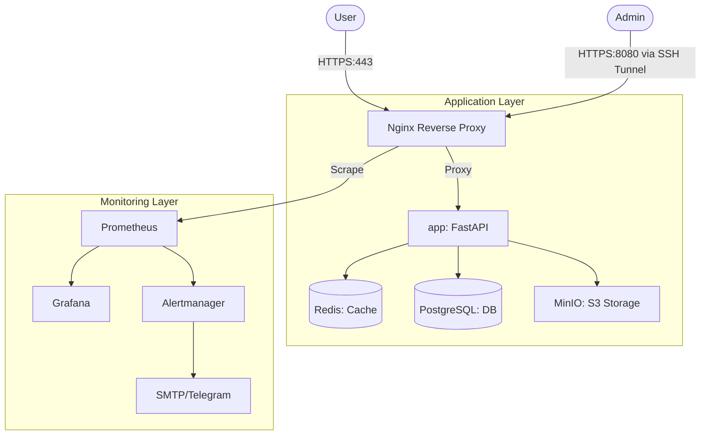

# Deployment Guide

This guide covers the architecture, orchestration, and CI/CD pipelines of the Urban Places Backend.

## Table of Contents

- [Architecture Overview](#architecture-overview)
- [Service Stack](#service-stack)
- [Orchestration (Ansible)](#orchestration-ansible)
- [CI/CD Pipeline (GitHub Actions)](#cicd-pipeline-github-actions)
- [Local Testing (Vagrant)](#local-testing-with-vagrant)
- [Production Deployment](#production-deployment)
- [Ansible Vault & Secrets](#ansible-vault-setup)
- [SSL Certificates](#ssl-certificates)
- [Troubleshooting](#troubleshooting)

---

## Architecture Overview

The system follows a containerized micro-service architecture managed via Docker Compose and orchestrated by Ansible.



### Traffic Flow

1. **External**: All public traffic hits **Nginx** (80/443). Nginx handles SSL termination and proxies requests to the `app` container.
2. **Internal**: Administrative tools (Grafana, Prometheus) are served by a separate **Internal Nginx** server block listening on `127.0.0.1:8080`. Access is only possible via SSH tunneling for security.

---

## Service Stack

| Service | Image | Description |
| --- | --- | --- |
| **Nginx** | `nginx:alpine` | Entry point, SSL termination, rate limiting, and internal proxying. |
| **App** | `custom:latest` | FastAPI application (Python 3.12). Handles API logic and WebSockets. |
| **DB** | `postgres:15-alpine` | Primary relational database for users, places, and social data. |
| **Redis** | `redis:7-alpine` | In-memory store for session caching, rate limiting, and WS signals. |
| **MinIO** | `minio/minio` | S3-compatible object storage for user-uploaded photos. |

---

## Orchestration (Ansible)

Deployment is automated using Ansible roles located in `deployments/ansible/roles/`.

### Roles Breakdown

#### 1. `setup`

- Installs Docker Engine, Docker Buildx, and Compose plugin.
- Syncs project files from the local environment to `/opt/places_backend` on the target host.
- Configures system-level requirements (e.g., rsync).

#### 2. `deploy`

- **SSL**: Generates self-signed certificates for non-prod environments.
- **Config**: Templates `nginx.conf` and `internal_nginx.conf` based on the target domain.
- **Runtime**: Executes `docker compose up -d` with environment variables injected from Ansible Vault.

#### 3. `monitoring`

- (Optional) Deploys the Prometheus/Grafana stack using `docker-compose.monitoring.yml`.
- Configures `alertmanager.yml` for notifications.

---

## CI/CD Pipeline (GitHub Actions)

The project uses GitHub Actions for automated testing and deployment.

### 1. CI Workflow (`ci-cd.yml`)

Runs on every push to `main` and `develop`.

- **Test**: Spins up real PostgreSQL/Redis containers and runs `pytest`.
- **Security**: Runs `bandit` to scan for Python security vulnerabilities.

### 2. CD Workflow (`Deploy.v2`)

Manual triggers or automatic on `main` merge.

- **Environment**: Pulls secrets from GitHub Secrets.
- **Orchestration**: Dynamically generates an Ansible Vault file and executes the `playbook.yml`.
- **Transparency**: The pipeline provides a full log of the deployment status.

---

## Local Testing with Vagrant

Test the full deployment locally before deploying to production.

Test the full deployment locally before deploying to production.

### 1. Start Vagrant VM

```bash
vagrant up
```

This creates an Ubuntu 22.04 VM at `192.168.56.2`.

### 2. Run Test Deployment

```bash
./deployments/test_deploy.sh
```

**What this script does:**

- Checks Vagrant is installed and VM is running
- Encrypts `deployments/ansible/test_vars.yml` with Ansible Vault
- Runs Ansible playbook against the Vagrant VM
- Deploys all services (Nginx, App, PostgreSQL, Redis, MinIO)
- Generates self-signed SSL certificates
- Cleans up temporary files

### 3. Verify Deployment

```bash
# From host machine
curl -k https://192.168.56.2/health

# Expected response
{"status":"healthy"}
```

### 4. Access Services

| Service | URL | Credentials |
|---------|-----|-------------|
| API | <https://192.168.56.2> | - |
| API Docs | <https://192.168.56.2/docs> | - |
| MinIO Console | <http://192.168.56.2:9001> | See `test_vars.yml` |

### 5. SSH into VM

```bash
vagrant ssh backend
```

### 6. View Logs

```bash
vagrant ssh backend -c "sudo docker logs places_backend-app-1 --tail 50"
```

---

## Production Deployment

### 1. Set Up Inventory

Edit `deployments/ansible/inventory.ini`:

```ini
[vps]
your-server-ip ansible_user=your_user ansible_ssh_private_key_file=~/.ssh/your_key
```

### 2. Create Production Variables

Create `deployments/ansible/group_vars/all/env.yml`:

```yaml
db_user: "prod_user"
db_password: "strong_random_password"
db_name: "places_prod"
redis_password: "strong_random_password"
minio_root_user: "admin"
minio_root_password: "strong_random_password"
domain: "yourdomain.com"
env_name: "prod"
```

### 3. Encrypt with Ansible Vault

```bash
cd deployments/ansible
ansible-vault encrypt group_vars/all/env.yml
# Enter vault password when prompted
```

### 4. Run Deployment

```bash
cd deployments/ansible
ansible-playbook -i inventory.ini deploy.yml --ask-vault-pass
```

### 5. Set Up Let's Encrypt

SSH into your server and run:

```bash
sudo docker compose --profile prod up -d
```

This starts Certbot which will:

- Obtain SSL certificates from Let's Encrypt
- Automatically renew certificates every 12 hours

---

## Ansible Vault Setup

### Creating the Vault Password File (Optional)

For CI/CD, store vault password in a file:

```bash
echo "your-vault-password" > ~/.vault_pass
chmod 600 ~/.vault_pass
```

Then use in GitLab CI:

```yaml
vault_password_variable: $ANSIBLE_VAULT_PASSWORD
```

### Encrypting Secrets

```bash
# Encrypt existing file
ansible-vault encrypt deployments/ansible/group_vars/all/env.yml

# Edit encrypted file
ansible-vault edit deployments/ansible/group_vars/all/env.yml

# Decrypt file (for debugging only!)
ansible-vault decrypt deployments/ansible/group_vars/all/env.yml
```

### Viewing Encrypted Content

```bash
ansible-vault view deployments/ansible/group_vars/all/env.yml
```

---

## SSL Certificates

### Development/Testing (Self-Signed)

For local Vagrant deployment, Ansible automatically generates self-signed certificates.

**Certificates location:** `/opt/places_backend/data/certbot/conf/live/{domain}/`

### Production (Let's Encrypt)

When `env_name: "prod"`, Certbot handles certificate generation:

1. **Initial Setup**: Ensure port 80 is accessible (for ACME challenge)
2. **Start with profile**: `docker compose --profile prod up -d`
3. **Verify certificates**: Check `/opt/places_backend/data/certbot/conf/live/{domain}/`

**Renewal**: Certbot automatically renews certificates every 12 hours.

### Force Certificate Renewal

```bash
sudo docker exec places_backend-certbot-1 certbot renew --force-renewal
sudo docker restart places_backend-nginx-1
```

---

## Environment Configuration

### Environment Modes

| Mode | Profile | Certbot | Certificates |
|------|---------|---------|--------------|
| `test` | None | Disabled | Self-signed |
| `prod` | `--profile prod` | Enabled | Let's Encrypt |

### Docker Compose Profiles

- **Default** (no profile): App, Nginx, DB, Redis, MinIO
- **prod**: Adds Certbot for Let's Encrypt
- **monitoring**: Adds Prometheus, Grafana (see [MONITORING.md](MONITORING.md))

### Environment Variables Flow

```
test_vars.yml (test) / env.yml (prod)
           ↓
    Ansible Vault (encrypted)
           ↓
   Ansible Environment Variables
           ↓
   docker-compose.yml (${VAR})
           ↓
      Docker Containers
```

**Key Point**: Secrets are **never** stored in plain text on disk. They exist only:

1. Encrypted in Ansible Vault
2. In memory during Ansible execution
3. As environment variables in running containers

---

## Troubleshooting

### Vagrant VM Network Issues

**Problem**: DNS resolution failures inside containers

**Solution**: VM uses systemd-resolved which conflicts with Docker DNS

- Fix applied: Explicit DNS servers (`8.8.8.8`, `1.1.1.1`) in `docker-compose.yml`

```bash
# Test DNS from VM
vagrant ssh backend -c "ping -c 3 google.com"
```

### Nginx Not Starting

**Problem**: SSL certificate errors

**Solution**: Check certificate paths and permissions

```bash
vagrant ssh backend
sudo docker logs places_backend-nginx-1
ls -la /opt/places_backend/data/certbot/conf/live/192.168.56.2/
```

### Database Connection Failures

**Problem**: Wrong credentials or service names

**Solution**: Verify environment variables

```bash
# Check what the app sees
vagrant ssh backend -c "sudo docker logs places_backend-app-1 | grep 'Using database URI'"

# Should show: postgresql+asyncpg://test_user:test_password@db:5432/places_db
```

### Permission Denied on Logs

**Problem**: App can't write to `/var/log/`

**Solution**: Already fixed - logs write to `/app/logs/` (writable by `appuser`)

### Ansible Vault Password Issues

**Problem**: "ERROR! Vault password file not found"

**Solution**: Use `--ask-vault-pass` flag or set up vault password file

```bash
ansible-playbook -i inventory.ini deploy.yml --ask-vault-pass
```

### Port Already in Use

**Problem**: Port 80/443 already bound

**Solution**: Check for existing services

```bash
sudo netstat -tlnp | grep :80
sudo systemctl stop apache2  # or nginx, if running
```

---

## Next Steps

After successful deployment:

1. **Configure DNS**: Point your domain to the server IP
2. **Set up monitoring**: See [MONITORING.md](MONITORING.md)
3. **Configure backups**: Set up database and MinIO backups
4. **Review security**: Check [Security Checklist](#security-checklist)

### Security Checklist

- [ ] Firewall configured (allow only 80, 443, SSH)
- [ ] SSH key-based authentication enabled
- [ ] Ansible Vault passwords are strong and secure
- [ ] Database passwords rotated from defaults
- [ ] Let's Encrypt certificates installed (production)
- [ ] HTTPS redirect enabled
- [ ] Rate limiting configured in Nginx
- [ ] Regular security updates scheduled

---

## Additional Resources

- [Ansible Documentation](https://docs.ansible.com/)
- [Vagrant Documentation](https://www.vagrantup.com/docs)
- [Docker Compose Documentation](https://docs.docker.com/compose/)
- [Let's Encrypt Documentation](https://letsencrypt.org/docs/)
