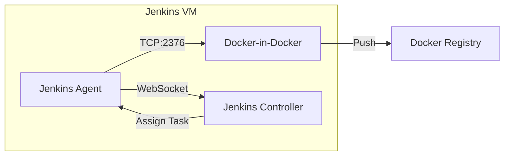

# Jenkins Infrastructure & CI/CD Guide

This guide details the Jenkins-based CI/CD infrastructure used for the Urban Places Social App.

## Architecture

The Jenkins stack is deployed using Docker Compose on a dedicated VM. It consists of three primary components:

1. **Jenkins Controller**: The main Jenkins instance (LTS).
2. **Jenkins Agent (Custom)**: A dedicated agent based on `jenkins/inbound-agent` with the **Docker CLI** installed. This allows the agent to build and push Docker images.
3. **Docker-in-Docker (DinD)**: A sidecar container (`docker:dind`) that provide a real Docker engine to the agent over a secured TCP connection.

### Diagram



## Deployment

The Jenkins stack is managed via Ansible.

### Prerequisites

- A target VM defined in your inventory (e.g., `ansible/inventories/test/hosts.ini`).
- The `jenkins` role configured.

### Using the Playbook

To deploy or update the Jenkins stack, run:

```bash
cd ansible
ansible-playbook -i inventories/test/hosts.ini playbooks/jenkins.yml \
  -e "jenkins_agent_secret=YOUR_AGENT_SECRET"
```

> [!NOTE]
> The `jenkins_agent_secret` is required for the agent to connect to the controller.

## How to Scale/Connect Agents

1. **Access Jenkins UI**: Go to `http://<YOUR_JENKINS_IP>:8080`.
2. **Retrieve Secret**:
   - Navigate to **Manage Jenkins** > **Nodes**.
   - Click on the node (e.g., `agent-1`).
   - Copy the value of the `-secret` field.
3. **Redeploy**: Run the Ansible playbook with the `-e` flag as shown above.

## Jenkins Agent (Custom Image)

The agent uses a custom Dockerfile located at `ansible/roles/jenkins/files/agent.Dockerfile`. This image is built automatically on the remote server by the Docker Compose stack.

It includes:

- `jenkins/inbound-agent` base.
- `docker.io` client for interacting with the DinD sidecar.
- WebSocket support for stable connections.
